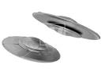

## Introduction

[The National UFO Reporting Center](http://www.nuforc.org/index.html) maintains an online database for reporting UFO sightings in the US and Canada.  Users enter the date of observation, location, shape of the UFO, duration of the sighting, and any additional comments that they may deem relevant.  Reports stretch back to the year 0200, but this app only uses the last ten years of data. 

Users can examine the data grouped by region of the United States or Canada, look for any trends in reported shape, and look at whether or not there is a statistically significant increase in sightings over the past 10 years.

The app can be found [here](https://ezcode123.shinyapps.io/UFOs/).



--- .class #id 

## Initial Graphs

When entering the app, the user will find two initial graphs:

```{r graphs, echo=FALSE, fig.height=4, fig.width=14, message=FALSE}

library(XML)
library(RColorBrewer)
library(ggplot2)
library(gridExtra)

# The following code can be used to load in the data from the web

#      dates <- c(seq(200401, 200412, by = 1), seq(200501, 200512, by = 1),
#                seq(200601, 200612, by = 1), seq(200701, 200712, by = 1),
#                seq(200801, 200812, by = 1), seq(200901, 200912, by = 1),
#                seq(201001, 201012, by = 1), seq(201101, 201112, by = 1),
#                seq(201201, 201212, by = 1), seq(201301, 201312, by = 1),
#                seq(201401, 201408, by = 1))
#      for (i in 1:length(dates)){
#           fileUrl <- paste("http://www.nuforc.org/webreports/ndxe", dates[i], ".html", sep="")
#           print(fileUrl)
#           table <- readHTMLTable(fileUrl, stringsAsFactors = FALSE)
#           ufodate <- data.frame(table[1], stringsAsFactors = FALSE)
#           names(ufodate) <- gsub("NULL.", "", names(ufodate))
#           if (i == 1) ufos <- ufodate else ufos <- rbind(ufos, ufodate)
#      }
#      
#      write.csv(ufos, file = "www/ufos.csv", row.names = FALSE)

# For expediency, the data was saved to a csv file and loaded to the server.

ufos <- read.csv("ufos.csv", stringsAsFactors = FALSE)

# Assign regions by state

where <- data.frame(state.abb, region = as.character(state.region), stringsAsFactors = FALSE)
others <- data.frame(state.abb = c("ON","BC","AB","SK","NB","QC","MB","NS","NF","YT","DC"), 
                     region = c(rep("Canada",10),"South"))
where <- rbind(where, others)
where$region <- ifelse(where$region == "North Central", "Midwest", 
                       where$region)
ufosByRegion <- merge(ufos, where, by.x = "State", by.y = "state.abb", all = FALSE)

# Clean up data for missing shapes and convert date to proper format

cleanufos <- ufosByRegion[!ufosByRegion$Shape == "",]
names(cleanufos)[names(cleanufos)=="Date...Time"] <- "Date"
cleanufos$Date <- as.Date(cleanufos$Date, "%m/%d/%y %H:%M")
cleanufos$Month <- format(cleanufos$Date, "%b")
cleanufos$Year <- as.numeric(format(cleanufos$Date, "%Y"))

mypalette <- c(brewer.pal(9,"Set1"), brewer.pal(12,"Set3"), brewer.pal(7,"Set2"))

# Overall summary for data by shape and region

sum12 <- aggregate(Posted ~ Shape + region, data = cleanufos, length)

# Two plots for initial view

     bar1 <- ggplot(sum12, aes(x=region, y=Posted)) 
     bar1 <- bar1 + geom_bar(stat = "identity", aes(fill = factor(Shape)))
     bar1 <- bar1 + scale_fill_manual(values=mypalette, name = "UFO Shape")
     bar1 <- bar1 + theme_bw() + labs(title="UFO Reports by Region and Shape \n")
     bar1 <- bar1 + theme(plot.title = element_text(size=rel(1.5), face="bold", vjust=1, color ="blue"))
     bar1 <- bar1 + xlab(label = "Region") + ylab(label = "Number Reported")
     
 
     pdata <- aggregate(Posted ~ Year, data = cleanufos, length)
     fit <- lm(Posted ~ Year, data = pdata)
     scatt <- ggplot(pdata, aes(x = Year, y = Posted))
     scatt <- scatt + geom_point(shape = 17,  size = 5, col = "magenta") + theme_bw()+ theme(legend.position = "none")
     scatt <- scatt + theme(plot.title = element_text(size=rel(1.5), face="bold", vjust=1, color = "blue"))
     scatt <- scatt + geom_smooth(method = lm, se = FALSE)
     scatt <- scatt + labs(title=paste("UFO Reports by Year in Region: ", "All", "\n", "For Shape ", "All", "\n",
                                       "Slope = ", round(fit$coeff[2], 2), "; p-value =", 
                                       round(summary(fit)$coeff[2,4], 5), "\n", sep = "")) 

grid.arrange(bar1, scatt, nrow = 1)          

```

The graph to the left can be used to select the region and shape of most interest.  The graph to the right shows that the number of UFO sightings has increased over the past 10 years.  The p-value of `r round(summary(fit)$coeff[2,4], 5)` indicates that the observed increase is statistically significant.

---

## User Inputs

There are two pulldown menus that will allow downselection of the data:

1. Region: 
     * Northeast, Midwest, South, West, and Canada.  
     * This can also be left to the default of "All".
2. UFO Shape:
     * `r unique(cleanufos$Shape)`
     * This can also be left to the default of "All".

---

## Output

1. If a Region is selected, the first graph will change to a simple barchart of that region's sightings by shape.
2. The scatterplot of reports over time will be updated in either Region or Shape is selected.  The data in the graph is limited to that Region/Shape and a new slope and p-value is reported.  This can be used to look for any increases or decreases in shape reporting over time, or for any regional differences.


